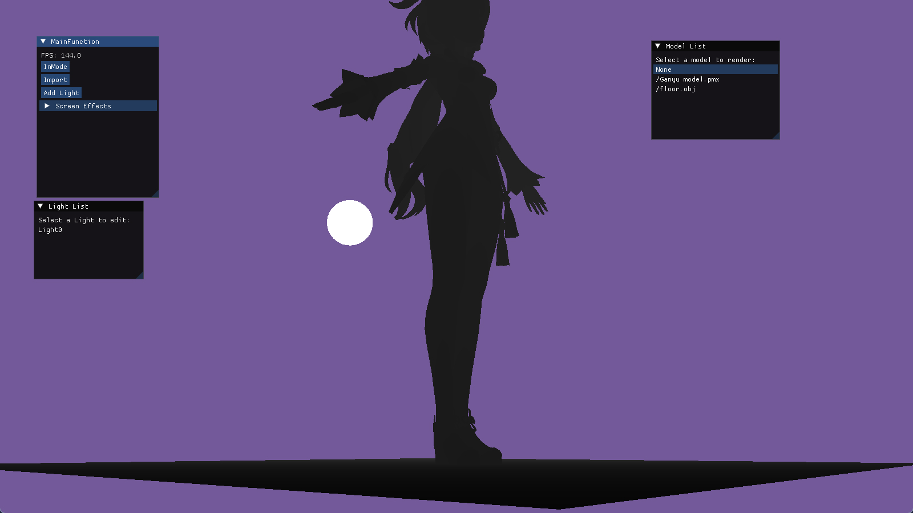
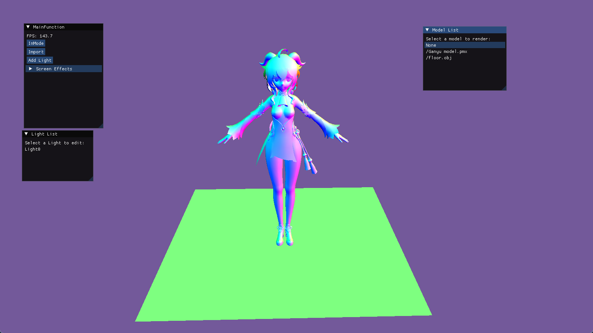
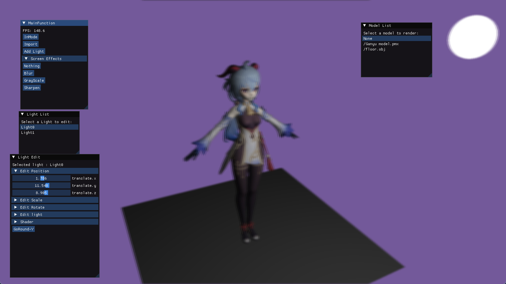
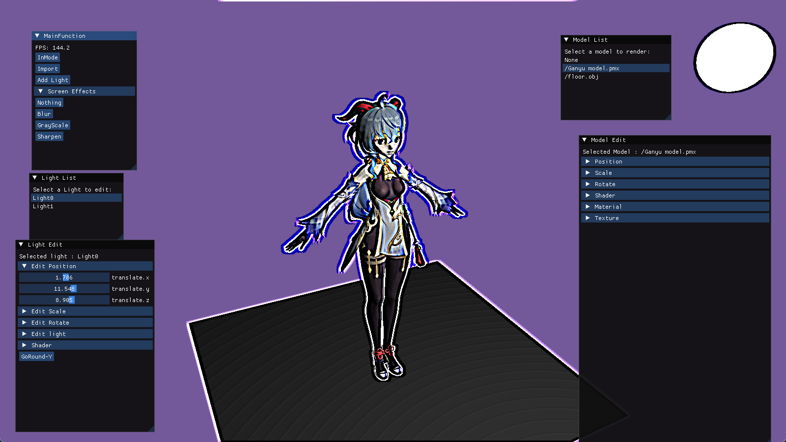
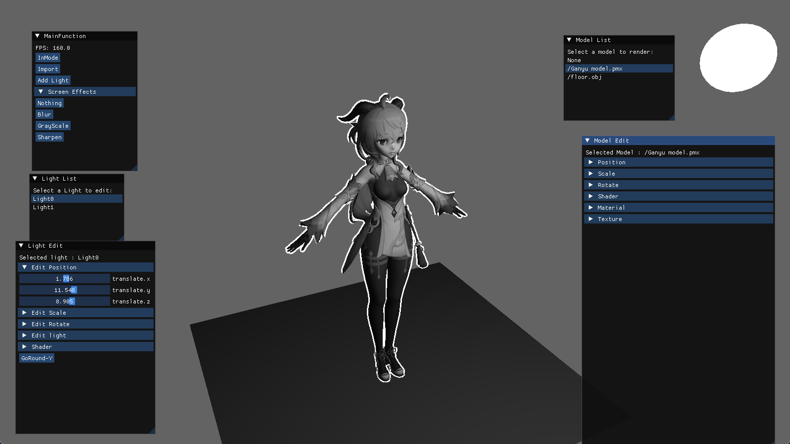
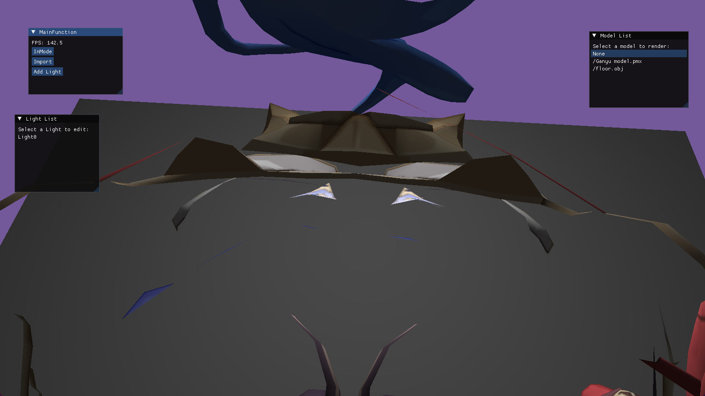
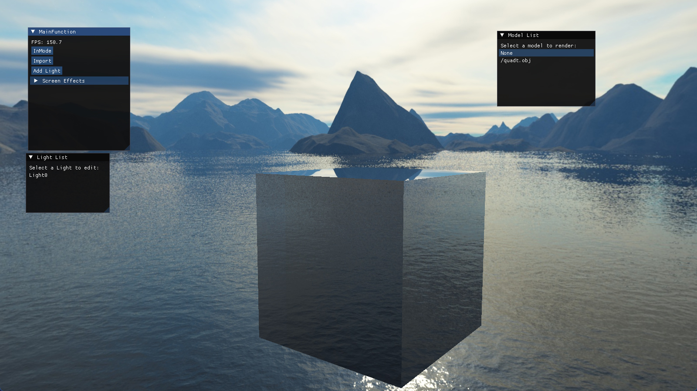
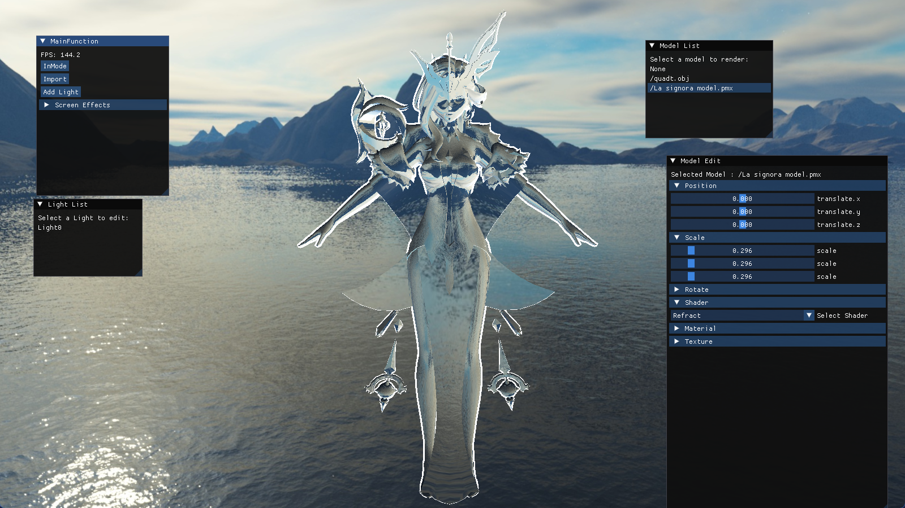

# 目录
- [目录](#目录)
- [Angine](#angine)
- [效果展示](#效果展示)
  - [learnOpengl](#learnopengl)
    - [Basic 基础功能](#basic-基础功能)
    - [高级Opengl篇](#高级opengl篇)

# Angine
An render engine using opengl and imgui. Just for learning!

# 效果展示
## learnOpengl
### Basic 基础功能
- Select Model (模板测试)
  
- BlinnPhone 着色
  
- Z-depth
  
- Normal
  

### 高级Opengl篇
- 帧缓冲
  - 模糊
    
  - 锐化
    
  - 灰度
    
  - 后视镜
    
- 面剔除
    
- 立方体贴图
  - 天空盒
    
  - 反射
    
  - 折射
    
