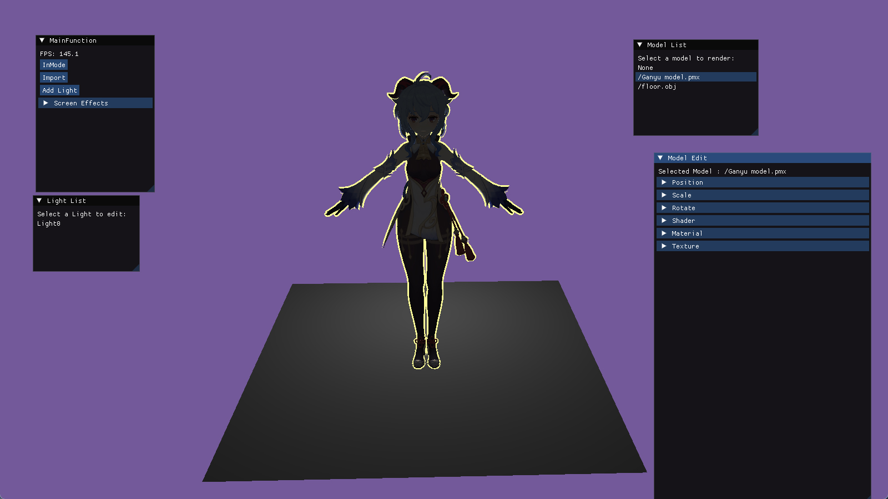

# 目录
- [目录](#目录)
- [Angine](#angine)
- [效果展示](#效果展示)
  - [Games202](#games202)
    - [homework0](#homework0)
    - [homework1](#homework1)
    - [homework2](#homework2)
    - [homework3](#homework3)
    - [SSAO](#ssao)
  - [learnOpengl](#learnopengl)
    - [Basic 基础功能](#basic-基础功能)
    - [高级Opengl篇](#高级opengl篇)
    - [高级光照](#高级光照)
    - [PBR](#pbr)
    - [延迟渲染](#延迟渲染)
    - [SSAO](#ssao-1)

# Angine
An render engine using opengl and imgui. Just for learning!

# 效果展示
## Games202
### homework0
> 环境测试  我就是移植到了自己的渲染器上 \
> 简单测试了PhongShader & PCF
> 

### homework1
- 1. shadowMap
  
  > ! 有明显的锯齿边
  
- 2. PCF
  
- 3. PCSS
  

### homework2
预计算环境光照 + 旋转光源

### homework3
SSAO
### SSAO
> 上图为 无SSAO 下图为 开启SSAO 

  
  

## learnOpengl
### Basic 基础功能
- Select Model (模板测试)
  
- BlinnPhone 着色
  
- Z-depth
  
- Normal
  

### 高级Opengl篇
- 帧缓冲
  - 模糊
    
  - 锐化
    
  - 灰度
    
  - 后视镜
    
- 面剔除
    
- 立方体贴图
  - 天空盒
    
  - 反射
    
  - 折射
    

### 高级光照
- 阴影
  - ShadowMapping
    
  - PCF
    

### PBR
- 直接光照pbr
  
  
- IBL
  - diffuse
    
  - specular
    

### 延迟渲染
- GBuffer渲染
  
  
  
  
  
- 延迟渲染
  

### SSAO
> 上图为 无SSAO 下图为 开启SSAO 

  
  